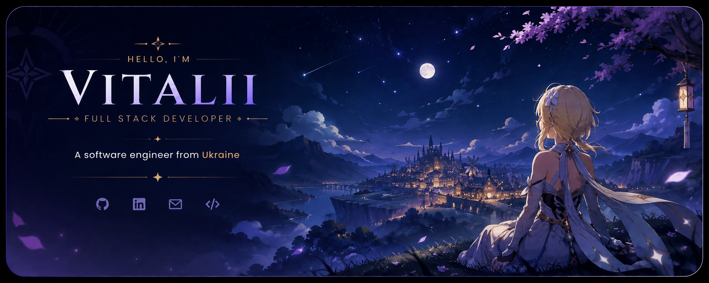
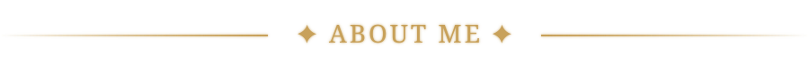
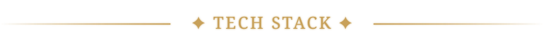
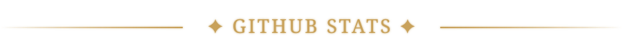
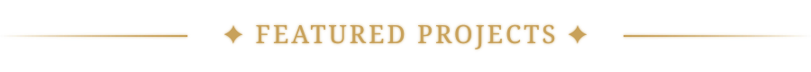

<!-- Banner -->

- 🔭 Currently working on: ...
- 🌱 Currently learning: ...
- 💬 Ask me about: ...
- ⚡ Fun fact: ...

**Languages**

**Frontend**

**Backend**

**Databases**

**DevOps**

**Work environment**

  

